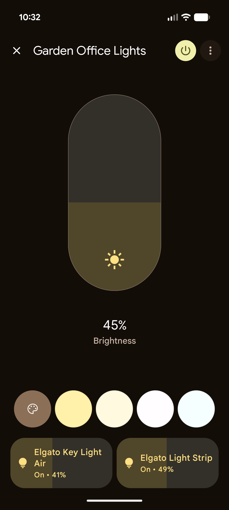

# matterbridge-elgato

Elgato lights in Google Home, Apple Home and Alexa. One Docker container, no
cloud, no account.

## The problem

Elgato's Key Lights and Light Strips are controlled from Control Center, which is
a separate app on a phone or a PC. So a Key Light cannot join a room with the
rest of the lights, cannot be part of a routine or a schedule, and does not
answer to a voice command. Turning the office lights off means walking to the
office or waking the PC up first. This bridge makes them ordinary Matter lights,
so the home app that is already on the phone controls them like any other bulb.



Two Elgato lights in a Google Home room, driven through this bridge.

## What you get

- On, off, brightness and color temperature on the Key Lights. On, off,
  brightness and color on the Light Strip.
- Rooms, groups, routines, schedules and voice control, in whichever app you
  already use. The bridge does none of that itself, the controller does. The
  lights just become normal devices it can drive.
- Local only. The lights speak HTTP on the LAN, the bridge speaks Matter on the
  LAN, and nothing leaves the house. There is no Elgato account and no cloud
  service in the path.
- Auto-discovery. Lights are found over mDNS and appear on their own. The
  registry is keyed by serial number, so a new DHCP address does not produce a
  duplicate device. There is a manual address list for networks that filter
  multicast.
- Three controllers at once. Matter multi-admin means the same bridge can be
  paired with Google Home, Apple Home and Alexa at the same time.

Everything runs inside [Matterbridge](https://github.com/Luligu/matterbridge),
which presents one bridge to the controllers and gives you a web frontend for the
pairing code, the plugin config and the device list.
[docs/how-it-works.md](docs/how-it-works.md) has the detail, and the limits.

## Requirements

- **An always-on Linux machine with Docker**, on the same LAN as the lights. A
  home server, a NAS that runs Docker (Synology, QNAP, Unraid), or a Raspberry
  Pi. The bridge only works while that machine is on.
- **Host networking for the container.** Matter and mDNS both work over
  multicast, which does not cross a Docker bridge network, so the container has
  to share the host's network stack.
- **Not Docker Desktop.** On macOS and Windows it runs Docker inside a VM, where
  `--network host` is the VM's network and not your LAN, so nothing is discovered
  and nothing pairs.
  [More on that](docs/install.md#docker-desktop-on-macos-and-windows-will-not-do).
- **IPv6 enabled on the LAN.** Matter talks IPv6 locally. Your internet
  connection does not need it, your router's LAN does.
- **A Matter controller**: a Nest hub or Nest Wifi point for Google Home, a
  HomePod or an Apple TV for Apple Home, an Echo (4th generation or newer) for
  Alexa.
- The lights on the same LAN as the host. A separate IoT VLAN needs mDNS
  reflection between the two, or the manual address list in
  [docs/configuration.md](docs/configuration.md).

## Install

Three ways in, all ending at the same container.

### 1. The setup command

```bash
npx matterbridge-elgato@latest setup
```

It checks Docker, picks the network interface that faces your LAN, writes
`./matterbridge-elgato/docker-compose.yml`, starts the stack, and prints the
frontend URL and the pairing code. Two more commands use the same `--dir`:
`status` prints whether the stack is running plus the last pairing code, and
`logs` tails the container log.

The full flag reference, a sample run, `--json` for scripts and agents, and
notes for Synology, QNAP, Unraid and Raspberry Pi are in
[docs/install.md](docs/install.md).

### 2. docker run

```bash
docker run -d --name matterbridge-elgato --network host --restart unless-stopped --stop-timeout 60 -e MDNS_INTERFACE=eth0 -e TZ=Europe/London -v "$PWD/data/.matterbridge:/root/.matterbridge" -v "$PWD/data/Matterbridge:/root/Matterbridge" -v "$PWD/data/.mattercert:/root/.mattercert" ghcr.io/passtas/matterbridge-elgato:latest
```

Replace `eth0` with the interface that faces your LAN (`ip -br addr` lists them)
and `Europe/London` with your timezone. The plugin is already installed in the
image and registers itself on first start, so there is no second command to run.
Open `http://<host-ip>:8283` for the pairing code.

### 3. Docker Compose

This is exactly the file the setup command writes.

```yaml
# Written by `npx matterbridge-elgato setup`. Safe to edit and re-run.
services:
  matterbridge-elgato:
    image: ghcr.io/passtas/matterbridge-elgato:latest
    container_name: matterbridge-elgato
    # Mandatory: Matter and mDNS both need the host network, and so does the
    # plugin's own _elg._tcp discovery of the Elgato lights.
    network_mode: host
    restart: unless-stopped
    stop_grace_period: 60s
    environment:
      # The LAN interface Matter advertises on. Docker hosts always have several
      # interfaces; naming the right one is what makes the bridge discoverable.
      MDNS_INTERFACE: eth0
      FRONTEND_PORT: "8283"
      TZ: Europe/London
    volumes:
      - ./data/.matterbridge:/root/.matterbridge
      - ./data/Matterbridge:/root/Matterbridge
      - ./data/.mattercert:/root/.mattercert
```

`docker compose up -d`, then open `http://<host-ip>:8283`. Back up
`data/.matterbridge` before any factory reset: it holds the Matter commissioning
data and the plugin config.

## Install with your AI assistant

If you use Claude Code, Codex, Cursor or a similar agent on the machine that will
run the bridge, paste this:

```text
Install matterbridge-elgato on this machine so my Elgato lights show up in my
smart home app. Read
https://raw.githubusercontent.com/passtas/matterbridge-elgato/main/AGENTS.md
first and follow the install procedure in it exactly, including the question it
tells you to ask me before you run anything.
```

The procedure starts by asking whether this is an always-on machine, because
installing on a laptop means installing Docker there and leaving the laptop
running. Answer that, and the rest is the setup command plus the pairing steps.

## Pairing

The pairing code shows up in three places, whichever suits you:

- printed by `setup` when it finishes, and again by `status`,
- in the Matterbridge frontend at `http://<host-ip>:8283`,
- in the log, as `Manual pairing code` and `QR Code URL`
  (`matterbridge-elgato logs`).

Then:

- **Google Home**: `+`, Set up device, Works with Google Home, Matter device,
  scan the QR code or type the manual code.
- **Apple Home**: `+`, Add Accessory, More options or "My device is not shown",
  then enter the code.
- **Alexa**: Devices, `+`, Add Device, Other, Matter, then enter the code.

You can pair more than one. After the first controller has adopted the bridge,
open the frontend's _Paired fabrics_ panel and turn pairing mode back on, then
run the next controller's flow. Each one gets its own fabric and they do not
interfere.

## Supported models

The plugin decides what a light is from the light's own reply, not from a table
of model numbers, so a model that is not listed here still stands a good chance
of working. The table is about what has been confirmed.

| Model              | Model number                          | Type code (`dt`) | Status                                                                               |
| ------------------ | ------------------------------------- | ---------------- | ------------------------------------------------------------------------------------ |
| Key Light Air      | 20LAB9901 (10LAB9901)                 | 200              | Verified                                                                             |
| Light Strip        | 20LAA9901 (10LAA9901)                 | 70               | Verified                                                                             |
| Key Light          | 20GAK9901 (10GAK9901)                 | 53               | Expected, please confirm                                                             |
| Key Light MK.2     | unknown (10GAK9901, same as the MK.I) | 205              | Expected, please confirm                                                             |
| Key Light Mini     | unknown (10LAD9901)                   | 202              | Expected, please confirm                                                             |
| Ring Light         | 20LAC9901 (10LAC9901)                 | 201              | Expected, please confirm                                                             |
| Light Strip Pro    | 20LAG9901 (10LAG9901)                 | 206              | Expected, please confirm                                                             |
| Key Light Neo      | unknown (10LAJ9901)                   | 210              | Uncertain discovery, use the manual address option                                   |
| Key Light Air MK.2 | 20LAM9901 (10LAM9901)                 | 214              | Not supported yet, see [#1](https://github.com/passtas/matterbridge-elgato/issues/1) |

"Verified" means the two lights this project was built against: a Key Light Air
and a Light Strip, tested live and paired to Google Home. "Expected" means the
model is known to speak the same local HTTP API, but nobody has run this plugin
against one. The Key Light Neo is separate: owners of other mDNS-based tools
report that Control Center finds the Neo while third-party clients do not, and
nobody has established why, so add it by address instead of relying on discovery.

The model number column shows the form that appears in the light's mDNS record
and in the plugin log, with the number printed on the retail box in brackets.
They differ only in the first digit.

If you own one of the unconfirmed models, a report fills in a row. There is a
template and a checklist in
[#4](https://github.com/passtas/matterbridge-elgato/issues/4).

A Key Light Air MK.2 is found and then left alone on purpose: that generation
speaks mutual TLS on port 9123 instead of the plain HTTP API. The plugin names it
in the log once and never probes it again. The protocol notes and the design are
in [#1](https://github.com/passtas/matterbridge-elgato/issues/1); somebody who
owns one has to build it.

## Configuration

Poll interval, color debounce, mDNS on or off, manual addresses, white and black
lists, and how device names are pinned:
[docs/configuration.md](docs/configuration.md). Edit it in the Matterbridge
frontend, or by hand in `matterbridge-elgato.config.json` in the Matterbridge
data directory.

## Footprint

Measured over 30 minutes on the machine below, with two lights connected:
process CPU about 0.02 %, resident memory about 195 MB steady, heap about 70 MB
and flat, no growth.

That was on a Beelink EQR6 mini PC (Ryzen 7 6800H, 32 GB) running Ubuntu 24.04
LTS on x86_64, Docker 29, alongside about twenty other containers, wired
Ethernet, a Google Nest Wifi mesh with the lights on 2.4 GHz, and a Nest hub as
the Matter controller. The lights were a Key Light Air on firmware 1.0.3 and a
Light Strip on firmware 1.0.4. The arm64 image is built in CI and has never been
run on hardware.

### Confirmed setups

| Piece      | What was tested                                                                          | Status                     |
| ---------- | ---------------------------------------------------------------------------------------- | -------------------------- |
| Host       | Beelink EQR6 (Ryzen 7 6800H, 32 GB), Ubuntu 24.04 LTS, x86_64, Docker 29, wired Ethernet | Confirmed 2026-09-05       |
| Network    | Google Nest Wifi mesh, lights on 2.4 GHz, host wired on the same LAN                     | Confirmed 2026-09-05       |
| Controller | Google Home, Nest hub as the Matter controller                                           | Confirmed 2026-09-05       |
| Lights     | Key Light Air fw 1.0.3, Light Strip fw 1.0.4                                             | Confirmed 2026-09-05       |
| Apple Home | HomePod or Apple TV as the Matter controller                                             | Expected, nobody has tried |
| Alexa      | Echo 4th generation or newer                                                             | Expected, nobody has tried |
| arm64      | Raspberry Pi or an ARM NAS                                                               | Image builds in CI, unrun  |

Add yours in [#4](https://github.com/passtas/matterbridge-elgato/issues/4) and it
goes in this table.

## Troubleshooting

Nothing found, pairing that never completes, a light that shows as unreachable,
and how to collect a log: [docs/troubleshooting.md](docs/troubleshooting.md).

## Contributing

Bug reports, device confirmations and pull requests are all welcome, and a
confirmation that one more light model works is as useful here as code.
[CONTRIBUTING.md](CONTRIBUTING.md) has the five commands that get you a working
checkout, the mock devices, the live tests, and what a good pull request looks
like. The open
[help wanted](https://github.com/passtas/matterbridge-elgato/labels/help%20wanted)
issues are the shortlist, starting with
[#1](https://github.com/passtas/matterbridge-elgato/issues/1) (Key Light Air
MK.2) and [#4](https://github.com/passtas/matterbridge-elgato/issues/4)
(confirmations wanted).

[docs/elgato-protocol.md](docs/elgato-protocol.md) is what the lights actually
do, checked against hardware, and
[docs/matterbridge-api-cheatsheet.md](docs/matterbridge-api-cheatsheet.md) is
what the plugin API actually does.

## Credits

[Matterbridge](https://github.com/Luligu/matterbridge) by Luligu (Apache-2.0)
does the hard part: it is the bridge, the frontend and the pairing flow, built on
[matter.js](https://github.com/project-chip/matter.js) by project-chip. This
plugin is a thin layer that turns Elgato lights into endpoints for it.

The protocol groundwork came from other people's work on the same lights:
[python-elgato](https://github.com/frenck/python-elgato) by frenck, which Home
Assistant uses and which is where the board type table comes from, and the
Homebridge Elgato plugins that got there first. The Key Light Air MK.2 protocol
is documented in [Lolgato issue
#14](https://github.com/raine/Lolgato/issues/14), where a user reverse-engineered
the whole TLS transport and wrote it down.

## License

MIT. See [LICENSE](LICENSE).
