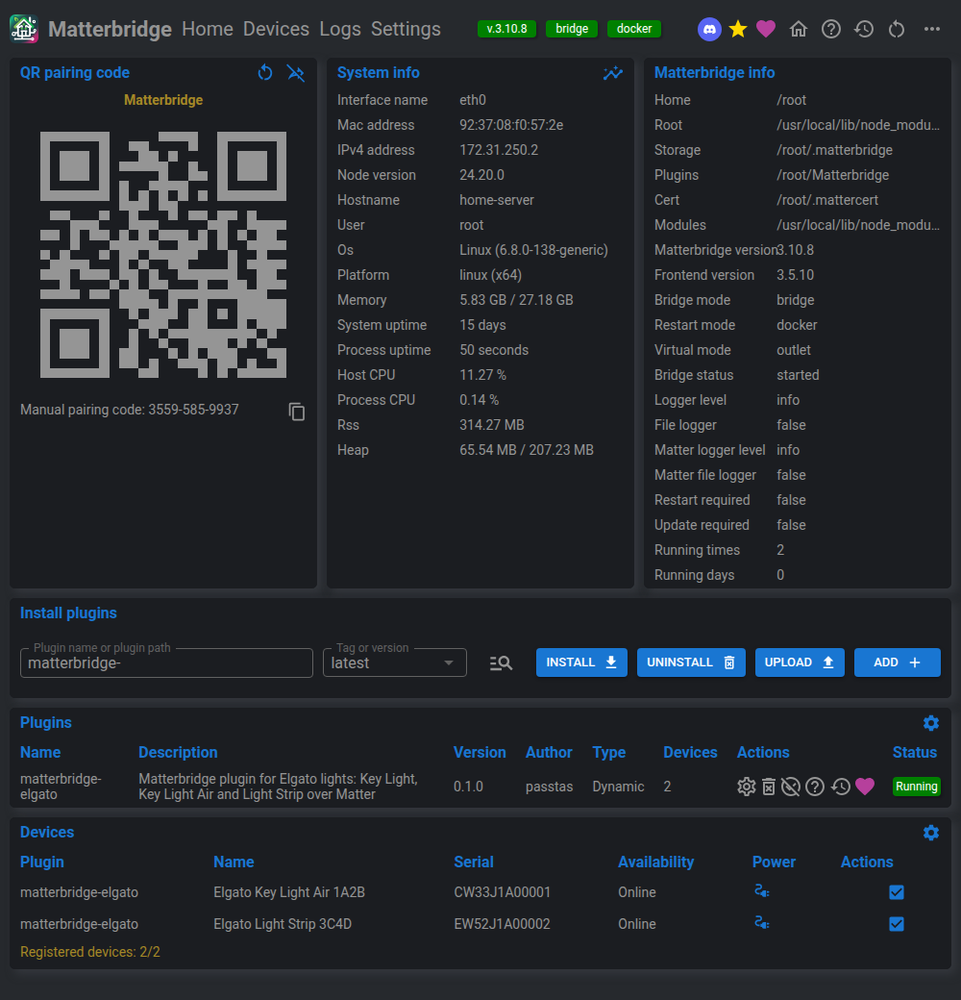

# How it works, and what it cannot do

Everything runs inside [Matterbridge](https://github.com/Luligu/matterbridge),
which presents one bridge to the controllers and gives you a web frontend for the
pairing code, the plugin config and the device list.

## How it works

- Lights announce themselves on mDNS as `_elg._tcp`, and the plugin browses for
  them continuously rather than once at startup. A light switched on later joins
  the bridge when it announces itself, with no restart.
- An announcement that names the light but carries no address is resolved with an
  mDNS query of the plugin's own, so it works in a container that cannot look up
  `.local` names. A `.local` host in the manual `devices` list gets the same
  treatment when the system cannot resolve it, even with `enableMdns` off.
- A light that does not answer, whether found on mDNS or listed under `devices`,
  is tried again after 10 seconds, then at doubling intervals up to every 5
  minutes, until it answers.
- Each light is filed under the serial number from its own
  `/elgato/accessory-info`, so a changed IP address moves the entry rather than
  creating a second one. A light that stops answering is looked up by its `.local`
  name again, so one that came back on a new DHCP lease is followed there.
- A light in the `devices` list keeps its configured `name` even when mDNS finds it
  first, for example when it was off while the bridge started.
- The Matter device type comes from the shape of the light's state: a light that
  reports a color temperature becomes a ColorTemperatureLight, one that reports
  hue and saturation becomes an ExtendedColorLight. Unknown models are handled by
  what they say, not by a lookup table.
- State is polled every 3 seconds by default, because the firmware has no push
  or subscription API. Commands from a controller are written straight away, not
  on the next tick.
- Every value is clamped before it is sent. The firmware does not clamp: a Key
  Light Air stores an out-of-range color temperature verbatim and desynchronizes,
  and a Light Strip answers HTTP 400 instead.
- The Light Strip loses its running scene the moment anything else is written and
  cannot list its scenes back, so the plugin remembers the last scene it saw and
  replays it when the light is switched back on. With `preserveSceneOnOff` on,
  switching off keeps the scene on the light as well (see
  [Light Strip scenes](configuration.md#light-strip-scenes)).

### Addresses from mDNS

The plugin browses with bonjour-service 1.4.4, which only attaches the A and AAAA
records that arrive in the same packet as the light's PTR record, and never
revisits them. Read from its `dist/lib/browser.js`:

- `buildServicesFor` (lines 158-205) builds a service only from a packet holding a
  PTR for `_elg._tcp.local`, so a later packet with just the A record is ignored.
- For a light already seen, only the SRV fields (lines 111-120) and the TXT record
  (121-130) are compared, never the addresses, so no event follows either.
- `update()` (85-87) only re-sends the PTR query, and `up` is only emitted for a
  light not seen before (104-110), so asking again changes nothing.
  `browser.services` (101-103) holds the same first record.

- An address change on its own raises no event either, and bonjour never expires
  a service (`expire()` exists, nothing calls it). `srv-update` only means the SRV
  target or port changed.

A Key Light Mini powered on while the bridge runs sends its A record in packets of
its own, a second before the PTR packet bonjour builds the service from, so its
`up` arrives with no address and stays at its `.local` name, which a Docker
container cannot resolve. The plugin therefore listens on bonjour's multicast
socket itself (`bonjour.server.mdns`, set in `dist/lib/bonjour.js` line 15):

- Every A record heard there is kept for its TTL, at most 2 minutes, and a TTL of
  0 (a goodbye) drops it. Usually the address of a name-only `up` is already known.
- Otherwise it sends an A query, and sends it again a second later within the 2 s
  window, because a light does not repeat an answer within 1 s of its last one
  (RFC 6762 §6) and ignores a query that lands just after its own announcement.
- It asks again whenever a probe of a light gets no answer, and when a registered
  light that sits on an IP address stops answering, at the retry backoff, so a
  light on a new lease is followed. A light kept on its name is left to the OS
  resolver.
- A `.local` host in the manual list is probed by name first, so a system whose
  resolver speaks mDNS keeps using the name and follows the light's address
  changes; only when that fails is the address from mDNS used. With `enableMdns`
  off, the plugin opens the mDNS socket for these lookups but browses nothing.
- If the socket fails (the port taken, or no permission), the plugin logs a
  warning and stops looking names up, rather than taking the bridge down:
  multicast-dns reports that as an `error` event that bonjour does not handle.

The announcement's source address (`service.referer`) is not used, because behind
an mDNS reflector it is the reflector's.

## Limitations

- **Polling, not push.** This generation of firmware has no event API, so a
  change made in Control Center or from a Stream Deck shows up within one poll
  interval, 3 seconds by default.
- **No scene engine in v0.1.** Scenes cannot be listed, created or chosen from a
  controller, because the firmware exposes no endpoint for it. The plugin can
  only put back the scene it last saw. Touching color or brightness from a
  controller destroys the running scene, and that is the device's behavior, not
  the bridge's.
- **Color temperature on the Light Strip is synthesized.** Matter expects an
  ExtendedColorLight to offer the control, but the strip has no white LEDs, so a
  warm or cool request becomes the nearest point on the color wheel. It looks
  close, not calibrated, and the light reports itself back in hue and saturation
  mode a few seconds later.
- **Renaming.** A rename in the Elgato app changes the displayed label but not
  the pinned Matter identity, by design. See [Device names and
  identity](configuration.md#device-names-and-identity) for how to change the
  pinned name.
- **Key Light Air MK.2 is skipped**, along with anything else that answers with
  the TLS transport. See the section below.
- **No battery reporting** for the Key Light Mini yet, no Bluetooth, no firmware
  updates, no Wave audio gear.
- Two writers at once race silently. The device has no version field to detect it
  with.

## Key Light Air MK.2 and newer

The Key Light Air MK.2 (`dt=214`, shipped July 2026) dropped the plain HTTP API.
It still advertises itself on `_elg._tcp` and still listens on port 9123, but the
port now wants a mutual-TLS WebSocket carrying JSON-RPC, and the client has to
present a certificate that chains to Elgato's own root.

What the plugin does today: it spots the MK.2, either from the `tls` key in its
mDNS record or from an HTTP probe that gets connected to and then hung up on, logs
one line naming the light, and leaves it alone. It never hangs on it and never
repeats the line for the same address.

Supporting it properly needs somebody who owns one, because none of it can be
tested otherwise. The protocol notes and a design that keeps Elgato's private
keys out of this repo are in
[#1](https://github.com/passtas/matterbridge-elgato/issues/1). Expect the same
transport on the Elgato lights that follow.
